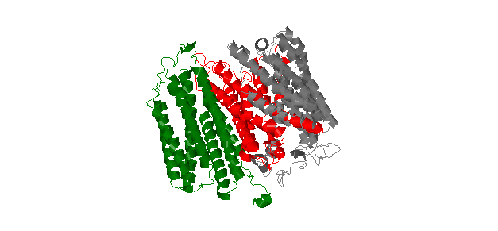
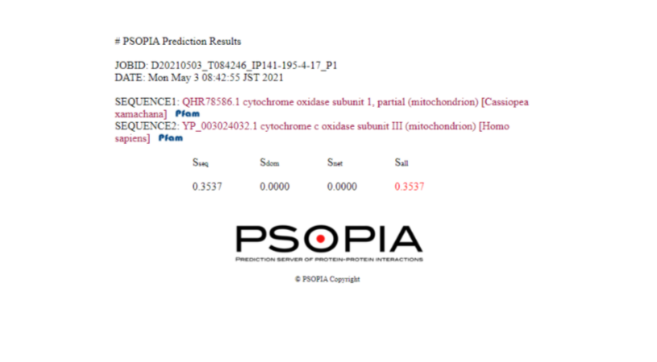

# Jellyfish-P2P-Interaction-Study
Regenerative jellyfish gene study
## Date: 20th May 2021

# Final Report Document:

My motivation for doing this research project was to possibly discover a new treatment for diseases. I wanted to see how regenerative genes in jellyfish interacted with human proteins.  This type of research could potentially lead to ways that gene therapy could treat diseases.  Studying regenerative genes could potentially help with degenerative diseases.  Huntington�s disease and other degenerative diseases could be fixed with a breakthrough in this field of bioinformatics.  

Before I continued with my, project I first had to do some additional background research.  I first wanted to see what similar work was already being done in the field.  The first study that introduced me to this being a possibility was Pattern regulation in a regenerating jellyfish. (elife sciences)  This study talked about how jellyfish could regenerate structures in its body. I wanted to look for genes that were responsible for this function.  I found one study, The Sine oculis/Six class family of homeobox genes in jellyfish with and without eyes: development and eye regeneration, which talked about how different gene expressions can cause different types of cell growth.(science direct)  I decided that I would be focusing on the findings of the one study, Regenerative Capacity of the Upside-down Jellyfish Cassiopea xamachana. (NCBI)  This research article found the gene they found responsible for regeneration in the cells in one type of jellyfish.  A couple of types of genes were identified in the study to be linked to the different types of cell regeneration in jellyfish.  A link to Genbank was provided in the study to the protein sequences.  These sequences are what I looked at in my research.
 
After researching for a bioinformatics tool that would help me identify possible protein-protein interactions with the genes I decide to use the program [HOMCOS](https://homcos.pdbj.org/cgi-bin/prot_sch_inp.cgi).  HOMCOS is a program that helps with the identification and modeling of proteins.   The tool required a protein sequence to be entered to compare it with other known sequences.  This is how I find other sequences that could help find what other proteins it could interact with for my project.  When the tool is run, a  model of the proteins is created which is very helpful because it helps gives a visual representation of what is happening.  The model seen below shows the protein to protein interaction between the COX1, a gene that has been found to be homologous with the jellyfish�s gene.  The red being the regenerative gene and the green being the protein it is interacting with.

COX1 was found to be 77.9% similar to the jellyfish gene.  The program also shows the contact points between the two protein sequences which are very useful in looking at proteins with significant homology.   Amino acid contact molecules are also displayed showing where and how it exactly would bind.   This is just to show what these contact points look like.  

Then, to find if these proteins would actually interact with each other I used a different tool.  I used [PSOPIA](https://mizuguchilab.org/PSOPIA/) which is the prediction server of protein to protein interactions.  This is where I took my data I found from the other tool.  This tool looks for similarities and differences in protein sequences.  It looks for the statistical propensities of domain pairs in the two protein sequences.  It works by entering in my base protein with one of the protein sequences that I collected from my tests using HOMCOS.  It then outputs scores of three different factors that go into the prediction of interaction.  The first one is the sequence similarities.  This compares like sequences to each other.  The second is the statistical propensities of domain-domain interactions.  It takes information from their database to use to determine domain-domain interaction.  The final one is the sum of edge weights between homologous proteins.  This is what it costs to move along something along with the protein.  They get all added together at the end to determine the prediction of interaction.  Using this tool, I can start to get a better understanding of the possibility of interaction.  If there is actually a chance of these proteins interacting with each other, it could lead to real-world experiments.  I first entered the jellyfish�s gene into the tool as the base sequence.  I then compared it to many different homologous proteins found by HOMCOS.  I tested six different homologous proteins with the jellyfish protein.  Them being COX3_Human, COX2_Human, COX1_Human, COX41_Human, COX7C_Human, and CX6A1_Human The only one to have any interactions with each other was the cytochrome c oxidase subunit 3(COX3_Human).

Even cytochrome c oxidase subunit 3 had a low interaction chance with the human genes I was comparing it to.  There was only a 0.3537 chance of interactions between the two proteins.  There was still interaction between the two unlike any of the other sequences, however, it still seemed like a low probability of interaction.  

I then took cytochrome c oxidase subunit 3 to [String](https://string-db.org/) to research it further.  String is able to help me learn a lot more about specific proteins I am working with.  I first took a look at what the gene affects in the mitochondrial complex.  The cytochrome c oxidase subunits one, two, and three are all part of the core of the Mitochondrial enzyme complex IV.  I looked further into this complex and found that it plays an important role in the electron transport chain.  It is part of a respiratory chain that transports molecular oxygen.  They all work together to then break down the oxygen into the water.  These oxidases play a key role in the mitochondria.  I then wanted to take a closer look at the different coexpressions of the gene.  There were multiple different coexpressions in Homo sapiens.  One of the ones that I took a look at MT-CO3 interacting with MT-CO1.  These two had a combined coexpression score of 0.979.  Another interaction where coexpression is observed is between MT-CO3 and MT-CYB.  These have an RNA coexpression score of 0.976.  The MT-CYB gene is ap a part of the mitochondrial respiratory chain.  It specifically controls the b-c1 complex that mediates electron transport in cytochrome c.  There is some evidence that there is an interaction between the two genes.  The next thing I wanted to take a look at was similar lab experiments that were done with these genes.  A similar pulldown assay was done when it was found that MT-CO3, a part of cytochrome c, was found to establish a molecular link between complexes that regular mitochondrial protein synthesis.  This suggests that it could be possible to bind with this protein and have some sort of interaction with it.  Another study that I found was Huntingtin interacting proteins are genetic modifiers of neurodegeneration. (PubMed) This pulldown assay was done testing the interaction between proteins between MT-CO3 and hunting disease (Htt) protein.  In the pulldown assay, they tested using yeast two-hybrid screening.  They identified that about 45% of alleles interacted and suppressed the neurodegeneration.  In these modifiers, there were 17 loss-of-function suppressors that were identified as sources for potential gene therapy. It is important to note that this study was performed on Htt from mice brains.  However, this could still indicate that something similar can be done to treat humans.

In conclusion,  I have found that there is some interesting information to be learned from jellyfish protein interactions.  There is some indication that interactions between the regenerative jellyfish gene and human genes.  The tools I used during my research were very effective in assisting me during my project. HOMCOS was very important in identifying other proteins that could interact with the jellyfish gene.  Without it, it would have been nearly impossible to identify them.  PSOPIA was also an invaluable tool to help separate potential matches and actual interactions.  String helped me gain more insight into the gene interactions that were taking place.  They helped me find similar interactions that could indicate of interactions. The cytochrome c oxidase subunit 3 was the only one that produced any significant interactions with human genes.  The one human gene that had the most significant interaction with MT-CO3.  Similar pulldown assays were performed to test the interaction of MT-CO3.  This is very similar to what I am trying to do in my project.  I think that there is some evidence of interaction between both of them.  However, it will not be possible to come to a conclusive answer until a pulldown assay is done with the jellyfish proteins.  I believe that it could be possible to create a type of gene therapy if a pulldown determines interaction.  

There are a lot of ethical concerns for this type of medicine and research.  For instance, it is possible that due to the nature of developing this research, gene therapy could be something that only wealthy people could afford.  According to the study: Controversies in Treatment Approaches: Gene Therapy, IVF, Stem Cells, and Pharmacogenomics, there is also a lot of concern among people that gene therapy is unnatural and �playing God�.(Nature)  This type of medicine is seen as not natural by the public, making it harder to introduce to the public.  The tools I used could be misused to create false information.  If someone was to do perform a research study and report false information, no one would be able to tell until someone discovers it.  This is unlikely because why would you do something that has already been done.  No one would ever know that false information is being incorporated into research.  Due to the open-source nature of the database, there isn�t much that can be done to find incorrect information without repeating the experiments.  Unrecognized false information could lead to more misinformation in the future.  If a study finds that a protein exists somewhere and another study is focusing on that protein, they could be researching something that doesn�t even exist.  The study, Ethical considerations of gene editing and genetic selection found that some unintentional mutations occurred when gene therapy tests.  Without actually doing something, it is impossible to be certain of the reaction it will have in a human.  Off-target mutations can lead to unintended consequences of gene therapy.  New medical conditions could be created in someone if the gene is not correctly created.  It could potentially lead to harm to anyone that would happen to use a faulty product.  Causing harm to someone potentially for the rest of their lives.  These unexpected mutations would almost be impossible to fix once the DNA mutated.  To prevent a situation like this there should be a governing body that would address these issues.  Someone who would oversee the information through some screening process.  There should also be a verification process that researchers should follow when entering their data.  I think that it would be beneficial to the integrity of sharing information.  Preventing misinformation like this could be prevented to stop accidents from happening that could potentially affect human life in a negative way.  Also, some way to report these false findings on the user end would be beneficial.  This could allow users experienced in the field to correct information posted by other users.  The issues would be able to take care of themselves within the community.  I think that this would be the best thing to do as you don�t have to worry about creating a new agency to govern it.
Bibliography

Gamero-Mora, Edgar, et al. �Regenerative Capacity of the Upside-down Jellyfish Cassiopea Xamachana.� Zoological Studies, Biodiversity Research Center, Academia Sinica, 4 Dec. 2019, www.ncbi.nlm.nih.gov/pmc/articles/PMC6971530/.

Hunt, Sonia Y. �Controversies in Treatment Approaches: Gene Therapy, IVF, Stem Cells, and Pharmacogenomics.� Nature News, Nature Publishing Group, 2008, www.nature.com/scitable/topicpage/controversies-in-treatment-approaches-gene-therapy-ivf-792/.

Kaltenbach LS;Romero E;Becklin RR;Chettier R;Bell R;Phansalkar A;Strand A;Torcassi C;Savage J;Hurlburt A;Cha GH;Ukani L;Chepanoske CL;Zhen Y;Sahasrabudhe S;Olson J;Kurschner C;Ellerby LM;Peltier JM;Botas J;Hughes RE; �Huntingtin Interacting Proteins Are Genetic Modifiers of Neurodegeneration.� PLoS Genetics, U.S. National Library of Medicine, pubmed.ncbi.nlm.nih.gov/17500595/.

Rothschild, Jodie. �Ethical Considerations of Gene Editing and Genetic Selection.� Wiley Online Library, John Wiley & Sons, Ltd, 29 May 2020, onlinelibrary.wiley.com/doi/full/10.1002/jgf2.321.

Sinigaglia, Chiara, et al. �Pattern Regulation in a Regenerating Jellyfish.� ELife, ELife Sciences Publications, Ltd, 7 Sept. 2020, elifesciences.org/articles/54868.

Stierwald, Michael, et al. �The Sine Oculis/Six Class Family of Homeobox Genes in Jellyfish with and without Eyes: Development and Eye Regeneration.� Developmental Biology, Academic Press, 1 Aug. 2004, www.sciencedirect.com/science/article/pii/S0012160604004348. 

